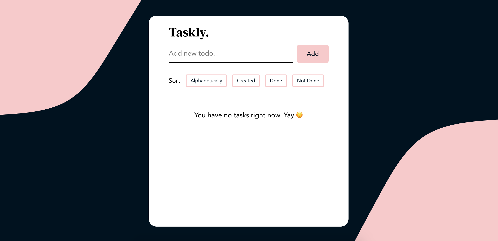

# React To-Do App ✍️
School project using with React, TypeScript and Sass. Users can add and delete tasks, mark them as done and sort tasks by name, creation date and status. 

https://taskly-react-app.netlify.app/

## Installation
1. Clone the repo\
`git clone https://github.com/malin-nilsson/React-TodoApp`

2. Install npm packages\
`npm install`

3. Run React\
`npm start`

## Author
- GitHub - [malin-nilsson](https://github.com/malin-nilsson)
